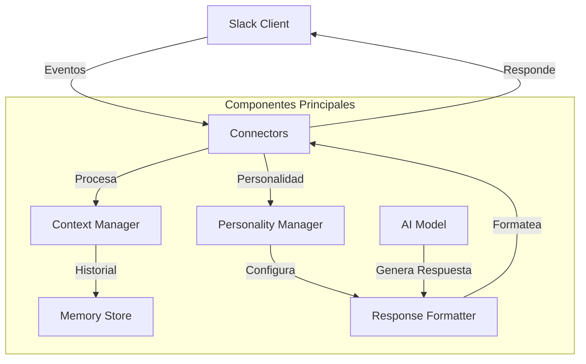

# Arquitectura y Patrones del Sistema Slack Bot

## Diagrama de Arquitectura de Alto Nivel

## Componentes Principales

### 1. Connectors
- **Responsabilidad**: Gestionar comunicación con Slack
- **Patrón**: Adapter Pattern
- **Implementación**: Slack Bolt Connector
- **Características**:
  * Manejo de eventos de Slack
  * Envío y recepción de mensajes
  * Gestión de autenticación

### 2. Context Manager
- **Responsabilidad**: Gestionar contexto conversacional
- **Patrón**: Memento Pattern
- **Implementación**: Almacenamiento de historial de conversación
- **Características**:
  * Seguimiento de estado de conversación
  * Recuperación de contexto histórico
  * Gestión de memoria a corto y largo plazo

### 3. Personality Manager
- **Responsabilidad**: Configurar comportamiento del bot
- **Patrón**: Strategy Pattern
- **Implementación**: Personalidades configurables
- **Características**:
  * Cambio dinámico de personalidad
  * Configuración de prompt del sistema
  * Gestión de plantillas de respuesta

### 4. Memory Store
- **Responsabilidad**: Almacenamiento persistente
- **Patrón**: Repository Pattern
- **Implementación**: Almacenamiento en memoria y base de datos
- **Características**:
  * Persistencia de contexto
  * Recuperación de información histórica
  * Gestión de caducidad de datos

### 5. Response Formatter
- **Responsabilidad**: Formatear respuestas de IA
- **Patrón**: Decorator Pattern
- **Implementación**: Formateo de respuestas según personalidad
- **Características**:
  * Transformación de respuestas de IA
  * Aplicación de reglas de formato
  * Adaptación al contexto

## Patrones de Diseño Utilizados

### 1. Dependency Injection
- **Contexto**: Inyección de dependencias en componentes
- **Problema**: Acoplamiento entre componentes
- **Solución**: Inyectar dependencias externamente
- **Consecuencias**: Mayor flexibilidad y testabilidad

### 2. Factory Method
- **Contexto**: Creación de objetos de personalidad
- **Problema**: Creación dinámica de objetos con comportamiento variable
- **Solución**: Método de fábrica para crear personalidades
- **Consecuencias**: Extensibilidad y desacoplamiento

### 3. Observer Pattern
- **Contexto**: Gestión de eventos de Slack
- **Problema**: Notificación de eventos a múltiples componentes
- **Solución**: Suscripción de componentes a eventos
- **Consecuencias**: Comunicación desacoplada entre componentes

### 4. Command Pattern
- **Contexto**: Procesamiento de comandos de usuario
- **Problema**: Encapsulación de acciones de usuario
- **Solución**: Objetos de comando para acciones
- **Consecuencias**: Flexibilidad en procesamiento de comandos

## Flujo de Procesamiento de Mensajes

1. **Recepción de Mensaje**
   - Connector recibe evento de Slack
   - Valida y normaliza mensaje
   - Extrae metadatos

2. **Gestión de Contexto**
   - Context Manager recupera historial
   - Analiza contexto conversacional
   - Prepara información para procesamiento

3. **Configuración de Personalidad**
   - Personality Manager selecciona personalidad
   - Configura prompt del sistema
   - Establece reglas de respuesta

4. **Generación de Respuesta**
   - Modelo de IA (Groq Llama3) procesa entrada
   - Genera respuesta basada en contexto
   - Aplica restricciones de tokens

5. **Formateo de Respuesta**
   - Response Formatter adapta respuesta
   - Aplica reglas de personalidad
   - Formatea para Slack

6. **Envío de Respuesta**
   - Connector envía respuesta a Slack
   - Registra interacción
   - Actualiza contexto

## Consideraciones de Escalabilidad

- Arquitectura modular
- Componentes desacoplados
- Soporte para múltiples instancias
- Gestión eficiente de recursos
- Tolerancia a fallos

## Mejoras Futuras

- Implementar Circuit Breaker para servicios externos
- Añadir caching de respuestas
- Mejorar tolerancia a fallos
- Implementar monitoreo de rendimiento
